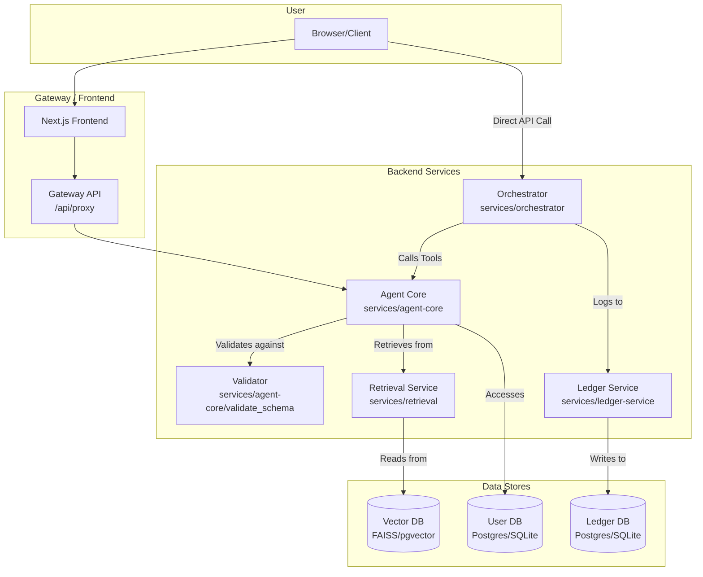

# AI Code Agent - v1.0.0

This project is a sophisticated, multi-service application designed for orchestrating complex AI-driven tasks. It provides a robust backend infrastructure and a feature-rich frontend for interacting with and visualizing the work of AI agents.

## Core Architecture

The application is built on a microservices architecture, ensuring scalability and separation of concerns.



## Quick Start

The fastest way to get the application running locally is with Docker Compose.

1.  **Create Environment File**: Copy the `.env.example` file to `.env` and fill in the required values, especially `JWT_SECRET`.
    ```bash
    cp .env.example .env
    # Open .env and add a long, random string for JWT_SECRET
    ```
2.  **Run Docker Compose**:
    ```bash
    docker-compose up --build
    ```
3.  **Access the Frontend**: Open your browser and navigate to `http://localhost:3000`.

## Detailed Installation

For development, you can run the services directly.

### Prerequisites
*   Python 3.11+
*   Node.js 18+
*   (Optional) Docker
*   (Optional) PostgreSQL instance

### Backend Setup

1.  **Create a virtual environment**:
    ```bash
    python -m venv venv
    source venv/bin/activate
    ```
2.  **Install Python dependencies**:
    ```bash
    pip install -r requirements.txt
    ```
3.  **Configure Environment**: Create a `.env` file from `.env.example` and set the required variables. For local development, you can leave the database URLs blank to use SQLite.
4.  **Run the Services**: Open multiple terminals and run each service:
    ```bash
    # Terminal 1: Ledger Service
    python services/ledger-service/main.py

    # Terminal 2: Retrieval Service
    python services/retrieval/main.py

    # Terminal 3: Agent Core
    python services/agent-core/main.py

    # Terminal 4: Orchestrator
    python services/orchestrator/main.py
    ```

### Frontend Setup

1.  **Navigate to the frontend directory**:
    ```bash
    cd frontend
    ```
2.  **Install Node.js dependencies**:
    ```bash
    npm install
    ```
3.  **Run the development server**:
    ```bash
    npm run dev
    ```
4.  The frontend will be available at `http://localhost:3000`.

## Build and Deployment

### Building Docker Images
Production-ready Dockerfiles are included for each service. You can build them manually or use the provided `docker-compose.prod.yml`.

To build a specific service image (e.g., the orchestrator):
```bash
docker build -f Dockerfile.orchestrator . -t your-repo/orchestrator:latest
```

### Production Deployment
The `docker-compose.prod.yml` file is configured to run the application stack behind an Nginx reverse proxy.

1.  **Ensure `.env` is configured** for your production environment (e.g., with production database URLs, secrets, and API keys).
2.  **Run the production stack**:
    ```bash
    docker-compose -f docker-compose.prod.yml up -d
    ```
3.  For a Kubernetes deployment, you can use the sample manifests in the `k8s/` directory as a starting point. The `deploy_k8s.sh` script provides a basic deployment workflow.

## Features Guide

### Orchestration Engine
The core of the application is the `Orchestrator` service, which manages complex, multi-step agent tasks.

*   **Durable Queue**: Tasks are managed in a crash-safe SQLite queue, ensuring that work is not lost if the service restarts.
*   **Fairness Scheduling**: This is a powerful hidden feature. The orchestrator can prioritize jobs from different projects based on configurable weights (`/admin/fairness/weights`). It ensures that high-priority projects get more resources while preventing smaller projects from being starved.
*   **Idempotent Execution**: The orchestrator tracks the status of each step. If a run is retried or resumed, it automatically skips steps that have already been completed successfully.
*   **Concurrency & Leasing**: The system uses a lease-based locking mechanism to allow multiple workers to process tasks in parallel without interfering with each other.

### Agent Core & Tooling
The `Agent Core` is responsible for executing individual tools and interacting with AI models.

*   **Dynamic Provider Adapters**: A key hidden feature is the ability to dynamically load adapters for different AI providers (e.g., OpenAI, Anthropic). This allows the system to be easily extended to support new models without changing the core logic.
*   **Schema-Enforced Guardrails**: All tool outputs are validated against Pydantic schemas. If a tool returns malformed data, the orchestrator will automatically retry the step, improving reliability.
*   **RAG Pipeline**: The `Retrieval Service` provides a sophisticated RAG pipeline with a swappable vector store backend (in-memory FAISS or persistent pgvector), enabling agents to pull in relevant context for their tasks.

### Security
*   **Authentication**: All sensitive endpoints are protected by JWT-based authentication. The `agent-core` service provides standard `/auth/register` and `/auth/login` endpoints.
*   **CSRF Protection**: The frontend and backend work together to prevent Cross-Site Request Forgery attacks. The frontend requests a unique CSRF token and includes it in a custom header for all state-changing requests.

### Observability & Admin
*   **Prometheus Metrics**: All services expose detailed metrics at their `/metrics` endpoint, covering everything from HTTP request latency to tool call counts and queue statistics.
*   **Distributed Tracing**: The orchestrator is instrumented with OpenTelemetry, creating detailed traces for each run. This allows you to visualize the entire workflow and identify bottlenecks.
*   **Admin API**: The orchestrator exposes a rich `/admin` API for monitoring and managing the system, including queue draining, fairness weight configuration, and data exports.

### Frontend Playgrounds
*   **Orchestrator Playground**: A powerful UI for developers and operators to experiment with orchestration plans. You can write a plan in JSON, execute it, and see the results in real-time.
*   **Live Visualizations**: The playground includes live-updating charts that visualize the performance of a run, including per-step timings and per-persona cost breakdowns.
*   **Trace Inspector**: For any given run, you can inspect a detailed trace of all tool calls in a flame-graph-style visualization, making it easy to debug complex orchestrations.
*   **Semantic Code Search**: A dedicated UI for performing semantic searches on the codebase.
